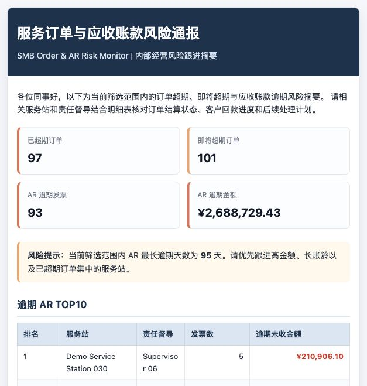

# SMB Order & AR Risk Monitor

中小企业服务订单与应收账款风险预警系统

🚀 Live Demo: https://smb-order-ar-risk-monitor-2rz65v4k6ep5cbesyprfs4.streamlit.app/

SMB Order & AR Risk Monitor is a Streamlit-based business risk monitoring tool that simulates order overdue tracking and accounts receivable risk alerts for commercial operations teams.

本项目基于企业商务运营中的订单超期、逾期通报与应收账款预警场景，使用模拟数据复现从 Excel 人工筛选到自动化风险识别、看板展示和通报生成的办公流程。

> 本项目仅使用模拟数据，不包含任何真实公司、真实员工、真实客户或真实邮箱信息。

## Project Overview

This project turns a repetitive commercial operations workflow into a lightweight office productivity tool. Users can upload order data, AR invoice data, and service-station mapping data, then let the app validate fields, apply business rules, calculate KPIs, visualize risks, and export follow-up reports.

The MVP is built for portfolio and interview demonstration. It focuses on clear business logic, explainable rules, and practical report generation rather than complex backend infrastructure.

## Why this project

In commercial operations, teams often need to manually download order data, filter overdue records in Excel, match responsible supervisors, generate reports, and prepare email notices. This project abstracts that workflow into a rule-based monitoring tool and demonstrates how repetitive business operations can be productized through Python, Pandas, and Streamlit.

## Business Workflow

上传订单明细、AR 明细和 Mapping 表 → 字段校验 → 订单超期规则计算 → AR 逾期识别 → 三表合并 → KPI 和图表 → Excel / HTML / txt 导出。

```text
Order CSV/Excel + AR CSV/Excel + Mapping CSV/Excel
        ↓
Required field validation
        ↓
Order overdue and due-soon rule engine
        ↓
AR overdue detection
        ↓
Order + AR + Mapping merge
        ↓
KPI cards and Plotly charts
        ↓
Excel risk report + HTML notice + email list export
```

## Business Rules

| Rule Area | Logic | Output |
| --- | --- | --- |
| F-type order overdue | F 类订单创建后超过 7 天仍未结算，且订单未取消 | `ORDER_OVERDUE`, `HIGH` |
| M-type order overdue | M 类订单创建后超过 30 天仍未结算，且订单未取消 | `ORDER_OVERDUE`, `HIGH` |
| Due soon order | 距离订单 deadline 0-7 天，且订单未取消、未完成结算 | `ORDER_DUE_SOON`, `MEDIUM` |
| AR overdue detection | `unpaid_amount > 0` 且 `today > due_date` | `AR_OVERDUE` |
| High risk | 已超期订单；或 AR 逾期超过 30 天；或 AR 未收金额大于 50000 | `HIGH` |
| Medium risk | 即将超期订单；或 AR 逾期 1-30 天；或 AR 未收金额在 10000-50000 | `MEDIUM` |
| Low risk | 其他关注项或正常记录 | `LOW` / `NORMAL` |

## Dashboard Preview


## HTML Notice Preview



## Exported Reports

The app provides three downloadable outputs:

- `smb_order_ar_risk_report.xlsx`: Excel risk report with risk orders, overdue AR, service station TOP10, and supervisor TOP10 sheets.
- `risk_notice.html`: Business-style internal notice with UTF-8 encoding, KPI summary cards, AR overdue TOP10, abnormal order TOP10, and follow-up suggestions.
- `risk_email_list.txt`: Deduplicated supervisor and service-station email list generated from simulated mapping data.

## Tech Stack

- Python
- Pandas
- Streamlit
- Plotly
- openpyxl
- xlsxwriter

## Local Setup

```bash
pip install -r requirements.txt
streamlit run app.py
```

Regenerate sample data if needed:

```bash
python src/data_generator.py
```

## Project Structure

```text
smb-order-ar-risk-monitor/
├── app.py
├── requirements.txt
├── README.md
├── LICENSE
├── .gitignore
├── .streamlit/
│   └── config.toml
├── assets/
│   ├── dashboard.png
│   └── html_notice.png
├── data/
│   ├── sample_orders.csv
│   ├── sample_ar.csv
│   └── sample_mapping.csv
├── src/
│   ├── __init__.py
│   ├── data_generator.py
│   ├── data_loader.py
│   ├── rules.py
│   ├── metrics.py
│   ├── report_generator.py
│   └── utils.py
└── outputs/
    └── .gitkeep
```

## Sample Data

The default `data/` folder includes simulated business data:

- `sample_orders.csv`: 360 service order records with order type, business line, product group, status, settlement status, service station, and amount.
- `sample_ar.csv`: 220 AR invoice records with invoice date, due date, invoice amount, paid amount, customer name, and service station code.
- `sample_mapping.csv`: 30 service station mapping records with fictional supervisors, station emails, and regions.

All sample names and emails are fictional, using demo-style names and `example.test` domains.

## Resume Description

中文简历版：

> SMB Order & AR Risk Monitor｜中小企业服务订单与应收账款风险预警系统｜个人项目  
> 基于企业商务运营中的订单超期、逾期通报和应收账款风险预警场景，自主开发 Streamlit 数据分析工具；使用 Python/Pandas 处理模拟订单明细、AR 明细和督导 Mapping 表，固化 F 类订单 7 天超期、M 类订单 30 天超期、7 天内即将超期、AR 逾期识别和逾期 TOP10 等规则；支持自动生成异常订单明细、HTML 通报、邮箱名单和 Excel 风险报告，并通过 Plotly 看板展示业务线、产品组、服务站和督导维度的风险分布。

English resume version:

> SMB Order & AR Risk Monitor | Personal Project  
> Built a Streamlit-based business risk monitoring tool using Python, Pandas, and Plotly to simulate order overdue tracking and accounts receivable risk alerts for commercial operations teams. Implemented CSV/Excel uploads, required-field validation, rule-based overdue detection, order/AR/mapping joins, KPI dashboards, Plotly visualizations, Excel report export, HTML notice generation, and deduplicated email-list export with fully simulated business data.

## Roadmap

- AI follow-up wording assistant for risk notices.
- Three-tone email templates: gentle, standard, and strict.
- Natural language Q&A, such as "Which service station has the highest overdue AR amount?"
- SQLite or PostgreSQL storage for historical uploaded data.
- User permission management by region or supervisor.
- Optional email automation with explicit safety controls.

## Scope Notes

This MVP intentionally does not implement user login, database storage, real email sending, LLM APIs, LangChain, LangGraph, or complex backend services. The goal is to keep the v0.1 release easy to run, easy to explain, and suitable for GitHub, resume, and interview demonstration.
