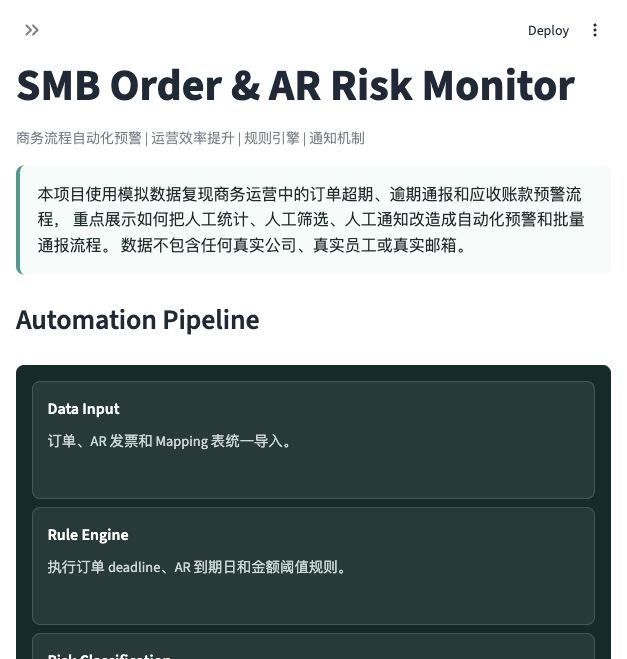

# SMB Order & AR Risk Monitor

商务流程自动化预警系统  
Business Process Automation / Operations Efficiency / Rule Engine / Notification Workflow

Live Demo: https://smb-order-ar-risk-monitor-2rz65v4k6ep5cbesyprfs4.streamlit.app/

本项目不是单纯的数据看板，而是一个模拟商务运营场景的轻量自动化工具：把订单超期、应收账款逾期、责任人匹配、风险报表和内部通报，从人工统计、人工筛选、人工通知，改造成规则驱动的自动化预警和批量通报流程。

> 本项目仅使用模拟数据，不包含任何真实公司、真实员工、真实客户或真实邮箱信息。

## 项目定位

| 维度 | 定位 |
| --- | --- |
| 核心场景 | 应收账款、订单超期、逾期通报、督导跟进 |
| 能力证明 | 业务规则拆解、流程自动化、异常识别、报表生成、邮件/通知逻辑、商务运营场景理解 |
| 适配岗位 | 解决方案运营、商业分析、运营产品、数据运营、流程数字化 |
| 关键词 | 自动化、预警、降本增效、流程改造、AR、Overdue、Notification |

## 业务背景

商务运营团队常见的重复工作包括：从系统导出订单和 AR 明细、在 Excel 中筛选超期记录、匹配服务站和督导、整理逾期金额、生成异常清单，并准备邮件或内部通报。本项目将这类办公流程抽象成一个可运行的 MVP，重点展示如何把人工跟进流程产品化。

## Business Process Automation Workflow

```text
Order Data + AR Data + Mapping Table
        ↓
Required Field Validation
        ↓
Business Rule Engine
        ↓
Exception Identification
        ↓
Risk Report + HTML Notice + Email List
        ↓
Follow-up and Batch Notification
```

| Step | Workflow | Output |
| --- | --- | --- |
| Step 1 | Load Business Data | 导入订单明细、AR 发票和督导 Mapping 表 |
| Step 2 | Apply Rule Engine | 固化 F 类 7 天、M 类 30 天、AR 到期日和金额阈值 |
| Step 3 | Identify Exceptions | 自动识别已超期、即将超期、AR 逾期和高风险服务站 |
| Step 4 | Generate Notices | 生成异常订单、逾期 AR、责任人和服务站通报对象 |
| Step 5 | Export Follow-up Pack | 导出 Excel 风险报告、HTML 通报和邮箱名单 |

## Business Rules

| Rule Area | Logic | Output |
| --- | --- | --- |
| F-type order overdue | F 类订单创建后超过 7 天仍未结算，且订单未取消 | `ORDER_OVERDUE`, `HIGH` |
| M-type order overdue | M 类订单创建后超过 30 天仍未结算，且订单未取消 | `ORDER_OVERDUE`, `HIGH` |
| Due soon order | 距离订单 deadline 0-7 天，且订单未取消、未完成结算 | `ORDER_DUE_SOON`, `MEDIUM` |
| AR overdue detection | `unpaid_amount > 0` 且 `today > due_date` | `AR_OVERDUE` |
| High risk | 已超期订单、AR 逾期超过 30 天、或 AR 未收金额大于 50000 | `HIGH` |
| Medium risk | 即将超期订单、AR 逾期 1-30 天、或 AR 未收金额在 10000-50000 | `MEDIUM` |

## Core Features

- 上传订单明细、AR 明细和服务站 Mapping 表。
- 校验必填字段，降低手工 Excel 处理中的漏字段风险。
- 使用规则引擎识别订单超期、即将超期和 AR 逾期。
- 按业务线、产品组、区域、服务站和督导汇总风险。
- 自动生成 Excel 风险报告、HTML 内部通报和去重邮箱名单。
- 用 Plotly 图表辅助定位风险集中区域，但项目重点是流程自动化和通报闭环。

## Automation Console Preview

首屏截图应展示 `Automation Pipeline → Action Queue → Automation Output Metrics → Generate Notification Preview`，突出自动化预警控制台，而不是普通数据看板。



截图位置：`assets/automation_console.png`

## HTML Notice Preview


## Exported Reports

- `smb_order_ar_risk_report.xlsx`: 风险订单、逾期 AR、服务站 TOP10 和督导 TOP10。
- `risk_notice.html`: 内部通报样式 HTML，包含 KPI、TOP 风险项和跟进建议。
- `risk_email_list.txt`: 基于模拟 Mapping 数据生成的去重通知对象名单。

## Tech Stack

- Python
- Pandas
- Streamlit
- Plotly
- openpyxl
- xlsxwriter

## Local Setup

```bash
pip install -r requirements.txt
streamlit run app.py
```

Regenerate sample data if needed:

```bash
python src/data_generator.py
```

## Project Structure

```text
smb-order-ar-risk-monitor/
├── app.py
├── requirements.txt
├── README.md
├── LICENSE
├── data/
│   ├── sample_orders.csv
│   ├── sample_ar.csv
│   └── sample_mapping.csv
├── src/
│   ├── data_generator.py
│   ├── data_loader.py
│   ├── rules.py
│   ├── metrics.py
│   ├── report_generator.py
│   └── utils.py
└── outputs/
```

## Sample Data

- `sample_orders.csv`: 模拟服务订单，包含订单类型、业务线、产品组、状态、服务站和金额。
- `sample_ar.csv`: 模拟 AR 发票，包含开票日期、到期日、发票金额、已付金额、客户和服务站。
- `sample_mapping.csv`: 模拟服务站、督导、邮箱和区域 Mapping。

所有样本名称和邮箱均为虚构数据。

## Resume Description

中文简历版：

> SMB Order & AR Risk Monitor｜商务流程自动化预警系统｜个人项目  
> 基于商务运营中的订单超期、逾期通报和应收账款预警场景，使用 Python、Pandas、Streamlit 搭建轻量自动化工具；将订单明细、AR 发票和督导 Mapping 表整合为规则驱动的异常识别流程，固化 F 类 7 天、M 类 30 天、7 天内即将超期、AR 逾期和金额阈值等业务规则；支持自动生成异常明细、Excel 风险报告、HTML 通报和邮箱名单，模拟将人工统计、筛选和通知流程改造成自动化预警与批量通报机制。

English resume version:

> Built SMB Order & AR Risk Monitor, a business process automation demo using Python, Pandas, Streamlit, and Plotly. Converted a manual commercial operations workflow into a rule-based alerting and notification process covering order overdue detection, AR overdue monitoring, supervisor mapping, Excel risk report export, HTML notice generation, and deduplicated email-list output with fully simulated data.

## Roadmap

- Three-tone notice templates for different follow-up scenarios.
- Optional email automation with explicit safety controls.
- Historical risk archive with SQLite or PostgreSQL.
- Natural language Q&A for risk follow-up questions.

## Scope Notes

This MVP intentionally does not implement user login, database storage, real email sending, LLM APIs, LangChain, LangGraph, or complex backend services. The goal is to keep the project easy to run, easy to explain, and suitable for GitHub, resume, and interview demonstration.
