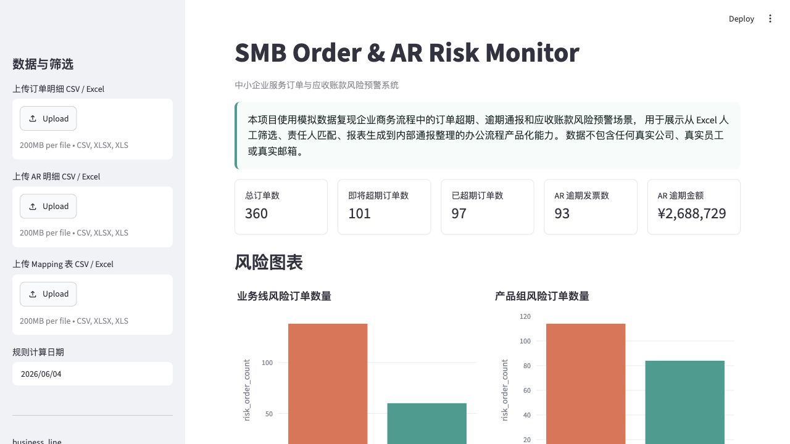

# SMB Order & AR Risk Monitor

中小企业服务订单与应收账款风险预警系统

🚀 Live Demo: https://smb-order-ar-risk-monitor-2rz65v4k6ep5cbesyprfs4.streamlit.app/



SMB Order & AR Risk Monitor is a Streamlit-based business risk monitoring tool that simulates order overdue tracking and accounts receivable risk alerts for commercial operations teams.

本项目基于企业商务运营中的订单超期、逾期通报与应收账款预警场景，使用模拟数据复现从 Excel 人工筛选到自动化风险识别、看板展示和通报生成的办公流程。

## Why this project

In commercial operations, teams often need to manually download order data, filter overdue records in Excel, match responsible supervisors, generate reports, and prepare email notices. This project abstracts that workflow into a rule-based monitoring tool and demonstrates how repetitive business operations can be productized through Python, Pandas, and Streamlit.

## 项目背景

本项目基于企业商务实习场景复盘，模拟服务订单超期、逾期通报和应收账款风险预警流程。项目目标是把人工 Excel 筛选、匹配责任人、统计 KPI、生成报表和整理通报文本的流程产品化，提升商务、运营和数据分析岗位中的日常办公效率。

本项目仅使用模拟数据，不包含任何真实公司数据、真实员工姓名或真实邮箱。

## 核心功能

- 上传订单明细、AR 明细和服务站 Mapping 表，支持 CSV、XLSX、XLS。
- 默认内置模拟数据，不上传文件也可直接运行 Demo。
- 自动识别订单已超期、即将超期和 AR 逾期风险。
- 按业务线、产品组、服务站、督导和区域生成风险汇总。
- 使用 Streamlit + Plotly 展示 KPI、图表和明细表。
- 一键下载 Excel 风险报告、HTML 内部通报文本和责任人邮箱名单。

## Business Rules

- F-type orders are considered overdue after 7 days.
- M-type orders are considered overdue after 30 days.
- Orders within 7 days before the deadline are marked as due soon.
- AR invoices are overdue when unpaid amount > 0 and current date > due date.
- Risk levels are assigned based on order status, overdue days, and unpaid amount.

## 业务规则说明

订单超期规则：

- F 类订单：7 天超期。
- M 类订单：30 天超期。
- 未申请或已申请结算，且订单未取消时，进入风险判断。
- 超过 deadline 的订单标记为 `ORDER_OVERDUE`。
- 距离 deadline 0-7 天的订单标记为 `ORDER_DUE_SOON`。

AR 逾期规则：

- `unpaid_amount = invoice_amount - paid_amount`。
- `overdue_days = today - due_date`。
- 未收金额大于 0 且已超过到期日时，标记为 `AR_OVERDUE`。

风险等级：

- `HIGH`：已超期订单；AR 逾期超过 30 天；或 AR 未收金额大于 50000。
- `MEDIUM`：即将超期订单；AR 逾期 1-30 天；或 AR 未收金额在 10000-50000。
- `LOW`：其他关注项。

TOP10 排序：

- 服务站 AR 逾期金额 TOP10。
- 督导异常订单数量 TOP10。

## 技术栈

- Python
- Pandas
- Streamlit
- Plotly
- openpyxl
- xlsxwriter

## 项目结构

```text
smb-order-ar-risk-monitor/
├── app.py
├── requirements.txt
├── README.md
├── .gitignore
├── data/
│   ├── sample_orders.csv
│   ├── sample_ar.csv
│   └── sample_mapping.csv
├── src/
│   ├── __init__.py
│   ├── data_generator.py
│   ├── data_loader.py
│   ├── rules.py
│   ├── metrics.py
│   ├── report_generator.py
│   └── utils.py
└── outputs/
    └── .gitkeep
```

## 本地运行方式

```bash
pip install -r requirements.txt
streamlit run app.py
```

如需重新生成模拟数据：

```bash
python src/data_generator.py
```

## 示例数据说明

`data/` 目录包含三份模拟数据：

- `sample_orders.csv`：服务订单明细，包含订单类型、业务线、产品组、服务站、结算状态和订单金额。
- `sample_ar.csv`：应收账款发票明细，包含发票金额、已收金额、客户名称和到期日。
- `sample_mapping.csv`：服务站责任人 Mapping 表，包含督导、邮箱和区域。

模拟数据覆盖已超期、即将超期和正常样本，日期围绕当前日期前后生成。所有公司、人员和邮箱均为虚构数据。

## 可写进简历的项目描述

中文简历版：

> 独立开发 SMB Order & AR Risk Monitor 中小企业服务订单与应收账款风险预警系统，基于 Python、Pandas、Streamlit 和 Plotly 将订单超期筛选、AR 逾期识别、责任人匹配、KPI 汇总和通报报表生成流程产品化；支持 CSV/Excel 上传、动态筛选、风险图表展示及 Excel/HTML/邮箱名单下载，模拟提升商务团队日常数据处理与逾期跟进效率。

English Resume Version:

> Built an SMB Order & AR Risk Monitor using Python, Pandas, Streamlit, and Plotly to automate service order overdue detection, accounts receivable risk monitoring, owner mapping, KPI reporting, and internal notice generation. Implemented CSV/Excel uploads, interactive filters, risk dashboards, and downloadable Excel, HTML, and email-list outputs with fully simulated business data.

## 后续优化方向

- 邮件自动发送：将导出的责任人邮箱名单接入企业邮箱或自动化平台。
- LLM 自动生成跟进话术：基于风险明细生成更个性化的催办或客户跟进建议。
- 用户权限：按区域、督导或角色限制可查看的数据范围。
- 数据库存储：将 CSV/Excel 文件替换为 PostgreSQL、MySQL 或云端数据表。
- 部署到 Streamlit Cloud：将 Demo 发布为可在线访问的作品集项目。

## 说明

本项目为可运行 MVP，未实现用户登录、数据库、真实邮件发送、LLM API、LangChain、LangGraph 或复杂后端。
